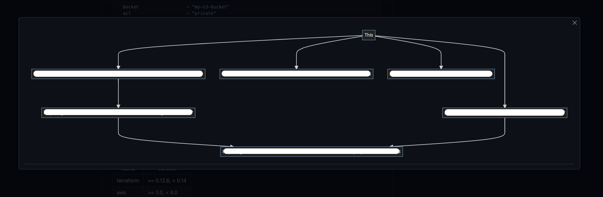
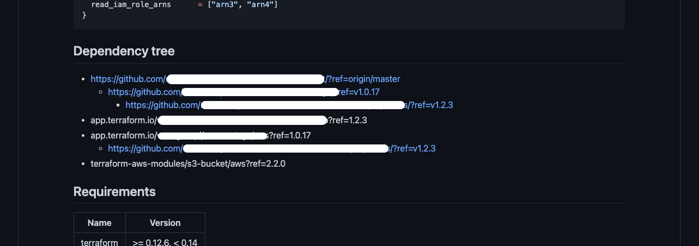

# Terraform Dependency Miner

Will mine out terraform dependencies and display them in a searchable or graphy format.

This can be plugged into terraform _or_ terragrunt. 

## What it do

### Mermaid


### Bullets


## Configurizering
 * Put the `miner.yaml` into your `.github/workflows/miner.yaml`
 * Set the parameters correctly:
   * Set yourself a token to give the runner access to private github repos
   * Set a token for terraform registry 
   * Set the output file
   * Set some markers in your file, if it already exists
 * On the next PR, the action will run and fill in a dependency graph
   * Because of hte use of UUIDs, the graph will change on every PR
```markdown
<!-- BEGIN_MINER_DOCS -->
<!-- END_MINER_DOCS -->
```

## Raw Usage
```yaml
    - name: terraform-dependency-miner
      uses: cypher7682/terraform-dependency-miner@<version>
      with:
        output_file: README.md
        output_format: mermaid
        mermaid_direction: TD
        terraform_registry_token: ${{ secrets.REGISTRY_TOKEN }}
        github_token: ${{ secrets.PRIVATE_TOKEN }}
```
